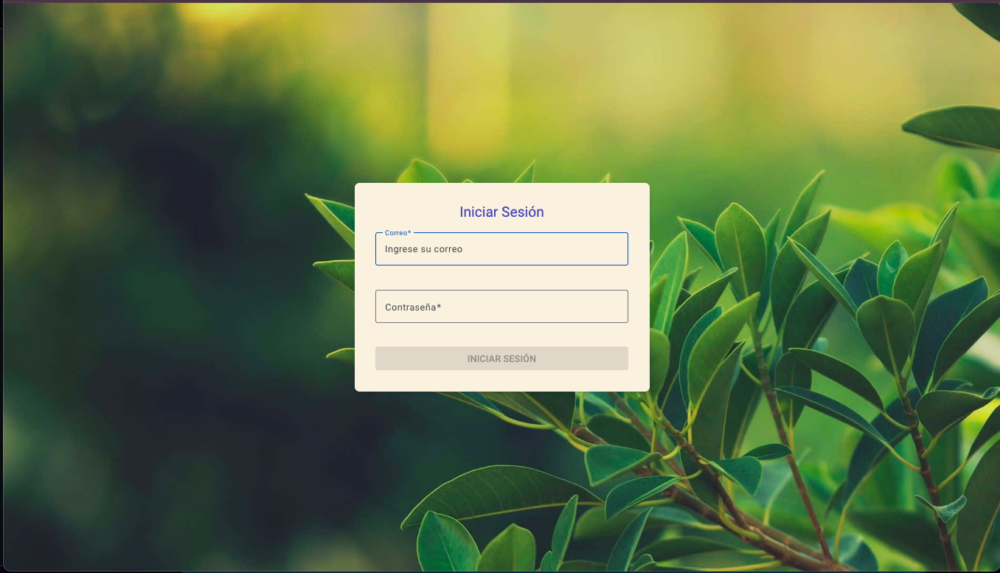
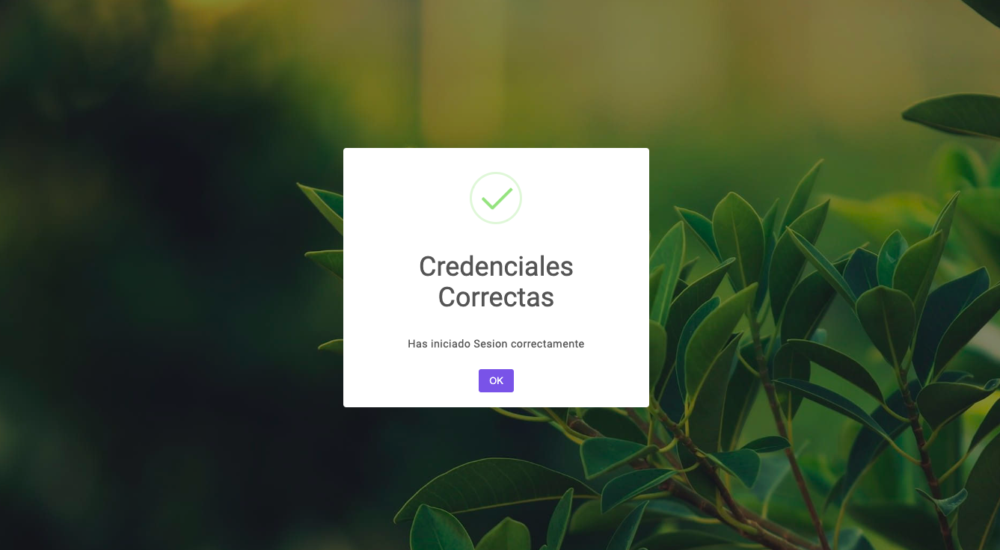
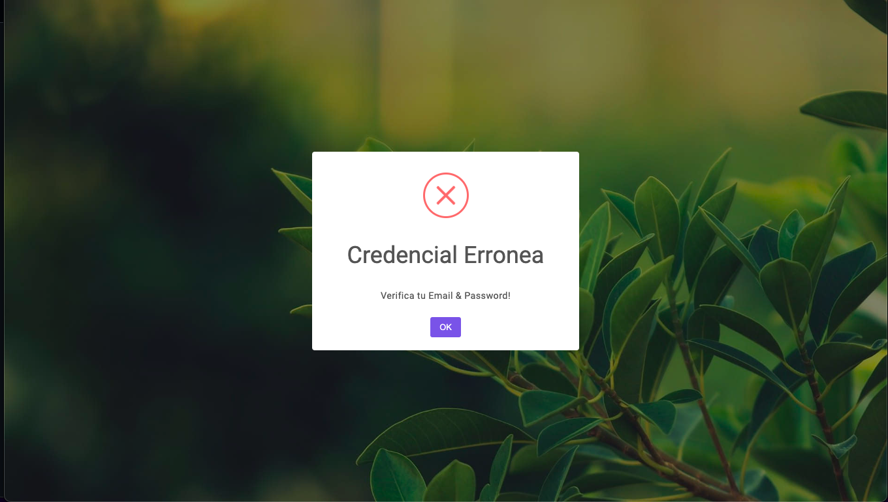
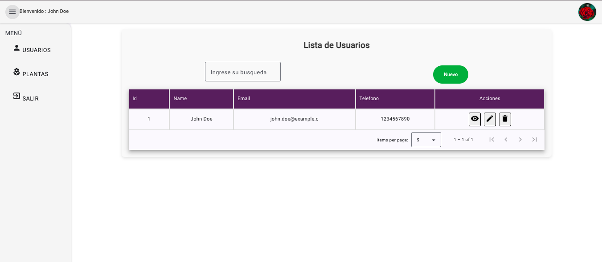
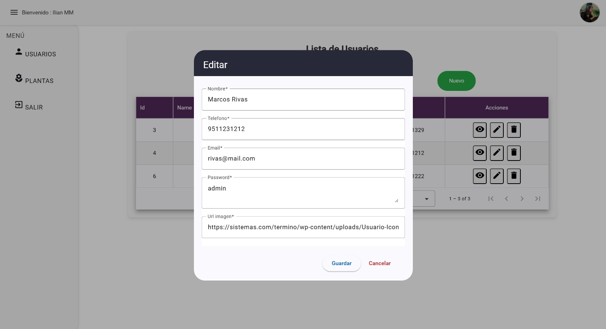
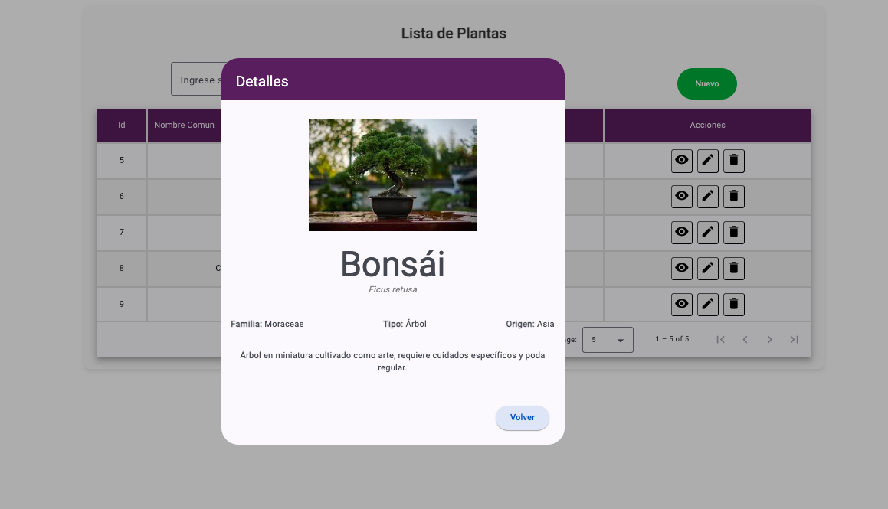
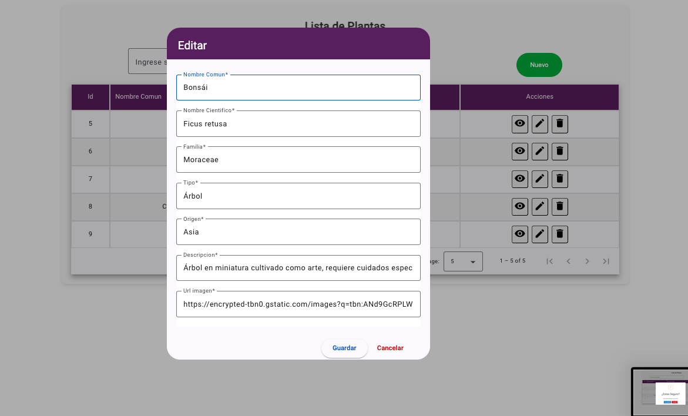
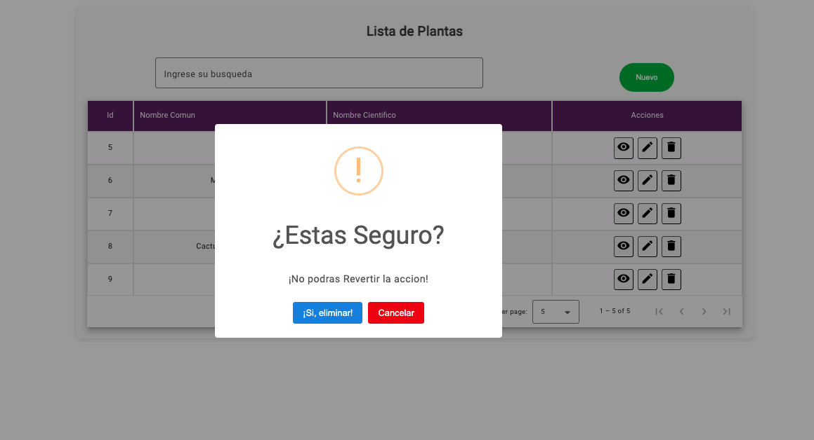
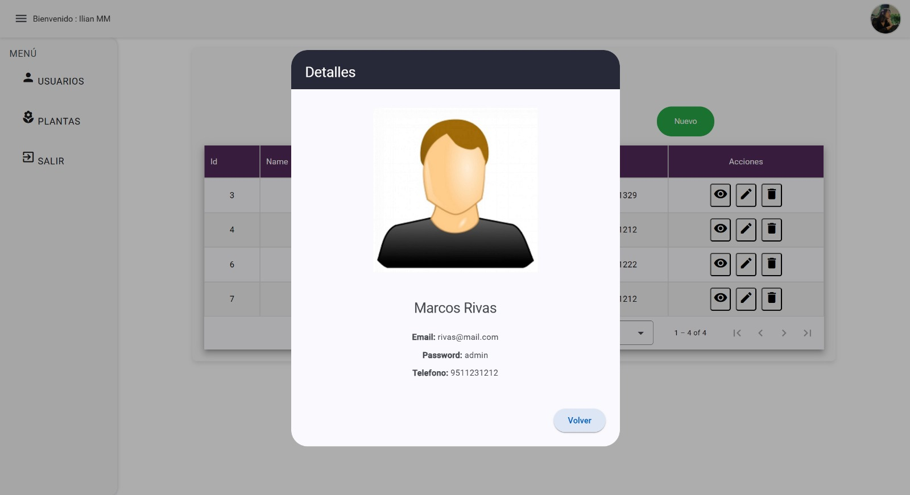
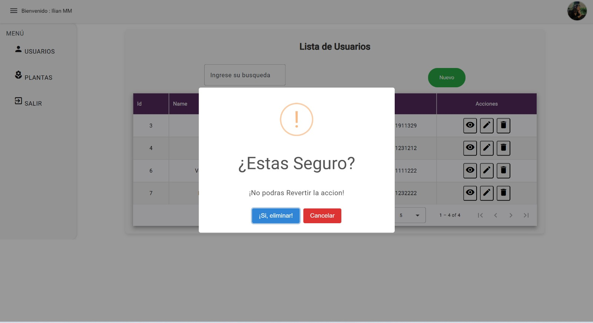

# Aplicación de Usuarios y Plantas - Frontend🖥
Este proyecto es el frontend para una aplicación de gestión de usuarios y plantas. Está construido con Angular y Material Design.

## 📌Características

- 📝 **Formulario de Login**: Permite a los usuarios ingresar sus credenciales (usuario y contraseña).
- 🔒 **Autenticación**: Se comunica con una API para validar las credenciales del usuario.
- 🎨 **Material Design**: La interfaz de usuario está elaborada con componentes de Material Design.

Después de un login exitoso, se podrá visualizar un menú en el cual el usuario podrá elegir entre dos opciones:

- 👤 **Tabla de Usuarios**: Una tabla con los datos de usuarios obtenidos de la API.
- 🪴 **Tabla Plantas**: Una tabla donde se usa un API de plantas.
En las tabla se implementa una columna con acciones; Ver, Editar y Eliminar.  
- ⚠️ **Manejo de Errores**: Se visualizan mensajes de error si las credenciales son incorrectas o si ocurre algún problema con la API, para ello se hace uso de sweetAlert.

## 💻 Requisitos

- Node.js
- Angular CLI

## 📦 Instalación

1. Clona el repositorio:

    ```sh
    git clone https://github.com/PeterThrs/api-laravel-fronted.git
    cd tu_repositorio_frontend
    ```

2. Instala las dependencias de npm:

    ```sh
    npm install
    ```

## 🔧Configuración

Configura la URL del backend en el archivo `src/app/services/planta.services.ts`:

```typescript
export const environment = {
  private urlBase = "http://localhost:8000/api/plants";
};
```

## 🚀 Ejecución del Servidor

Inicia el servidor de desarrollo:
```sh
ng serve
``` 

## 🏛 Estructura de la Interfaz

1. **Inicio de Sesión**:
   - La aplicación integra un sistema de inicio de sesión para personalizar la experiencia del usuario.
   - Una vez que el usuario se autentica, su nombre se muestra en la barra superior como confirmación de la sesión activa.
   - Este sistema asegura que solo los usuarios autorizados puedan acceder a ciertas funcionalidades específicas.
   -En caso contrario que las contraseñas ingresadas sean incorrectas mostrara un mensaje d elerta y no dejara ingresar.

Login:


- **Mensajes credenciasles correctas e incorectas**
<div style="display: flex; justify-content: space-between; width: 100%;">
  
  
</div>


2. **Encabezado**:
   -Una vez que el usuario coloco las credenciales correctas e ingreso al sistema podra visualizar:
   - Barra de navegación donde puedes alternar entre la vista de plantas y la vista de usuarios.
   - Una barra superior que muestra el nombre del usuario que ha iniciado sesión.

2. **Tabla de Plantas o Usuarios**:
   - Muestra los campos mencionados anteriormente en un formato tabular.
   - Cada fila representa una planta o usuario distinto.

3. **Búsqueda y Filtrado**:
   - Barra de búsqueda para encontrar plantas por nombre común o científico, en el caso de encontrarse en la sección de usuarios buscar a estos.

4. **Boton "Nuevo"**:
   - Botón en el que se crea un nuevo elemento dependiendo de la interfaz en el que nos encontremos.

 Interfaz(Tabla):


Boton(Nuevo):


  
## Campos de la Tabla

La tabla de plantas muestra los siguientes campos:
1. **Id**: Id autoincremental de acuerdo al registro.
2. **Nombre Común**: Nombre con el que se conoce comúnmente la planta.
3. **Nombre Científico**: Nombre formal en latín de la planta.
4. **Acciones**: Opciones por cada planta para ver mas detalles, editar información o eliminarla.

<div style="display: flex; justify-content: space-between; width: 100%;">
  
  
  
</div>

## Campos de la Usuario

La tabla de usuarios muestra los siguientes campos:
1. **Id**: Id autoincremental de acuerdo al registro.
2. **Nombre**: Nombre el usuario.
3. **Email**: Dirección de correo del usuario.
3. **Telefono**: Telefono (10 digitos).
4. **Acciones**: Opciones por cada usuario para ver mas detalles, editar información o eliminar.

<div style="display: flex; justify-content: space-between; width: 100%;">
  
  
  
</div>

## ✒️ Autores 
   - Pedro López** - [PeterThrs 👾](https://github.com/PeterThrs)

   - Ilian Morales** - [iliMorales 💜](https://github.com/Ilimm9)